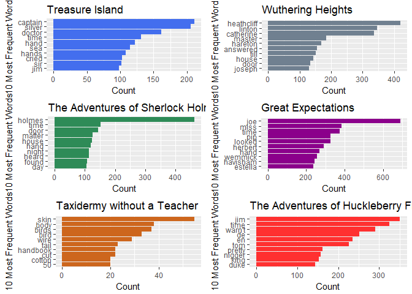

Gutenberg
================
Hilary
February 4, 2018

``` r
library(gutenbergr)
```

    ## Warning: package 'gutenbergr' was built under R version 3.4.3

``` r
library(dplyr)
```

    ## 
    ## Attaching package: 'dplyr'

    ## The following objects are masked from 'package:stats':
    ## 
    ##     filter, lag

    ## The following objects are masked from 'package:base':
    ## 
    ##     intersect, setdiff, setequal, union

``` r
library(tidytext)
```

    ## Warning: package 'tidytext' was built under R version 3.4.3

``` r
library(stringr)
#to get an Excel file of all the works in Project Gutenberg
write.csv(x = gutenberg_works(), file = "works.csv")

#want Treasure Island
gutenberg_metadata %>% filter(title == "Treasure Island") #120
```

    ## # A tibble: 3 x 8
    ##   gutenberg_id           title                  author gutenberg_author_id
    ##          <int>           <chr>                   <chr>               <int>
    ## 1          120 Treasure Island Stevenson, Robert Louis                  35
    ## 2        23936 Treasure Island Stevenson, Robert Louis                  35
    ## 3        27780 Treasure Island Stevenson, Robert Louis                  35
    ## # ... with 4 more variables: language <chr>, gutenberg_bookshelf <chr>,
    ## #   rights <chr>, has_text <lgl>

``` r
#want Wuthering Heights
gutenberg_metadata %>% filter(title == "Wuthering Heights") #768
```

    ## # A tibble: 1 x 8
    ##   gutenberg_id             title        author gutenberg_author_id
    ##          <int>             <chr>         <chr>               <int>
    ## 1          768 Wuthering Heights Brontë, Emily                 405
    ## # ... with 4 more variables: language <chr>, gutenberg_bookshelf <chr>,
    ## #   rights <chr>, has_text <lgl>

``` r
#Want Adventures of Sherlock Holmes
gutenberg_works(str_detect(title, "Adventures of Sherlock Holmes")) #1661
```

    ## # A tibble: 2 x 8
    ##   gutenberg_id                                        title
    ##          <int>                                        <chr>
    ## 1         1661            The Adventures of Sherlock Holmes
    ## 2        48320 "Adventures of Sherlock Holmes\nIllustrated"
    ## # ... with 6 more variables: author <chr>, gutenberg_author_id <int>,
    ## #   language <chr>, gutenberg_bookshelf <chr>, rights <chr>,
    ## #   has_text <lgl>

``` r
#want Taxidermy w/o a teacher
gutenberg_works(str_detect(title, "Taxidermy without")) #51439
```

    ## # A tibble: 1 x 8
    ##   gutenberg_id
    ##          <int>
    ## 1        51439
    ## # ... with 7 more variables: title <chr>, author <chr>,
    ## #   gutenberg_author_id <int>, language <chr>, gutenberg_bookshelf <chr>,
    ## #   rights <chr>, has_text <lgl>

``` r
#want Great expectations
gutenberg_metadata %>% filter(title == "Great Expectations") #1400
```

    ## # A tibble: 2 x 8
    ##   gutenberg_id              title           author gutenberg_author_id
    ##          <int>              <chr>            <chr>               <int>
    ## 1         1400 Great Expectations Dickens, Charles                  37
    ## 2         8608 Great Expectations Dickens, Charles                  37
    ## # ... with 4 more variables: language <chr>, gutenberg_bookshelf <chr>,
    ## #   rights <chr>, has_text <lgl>

``` r
#want Adventures of Huck Finn
gutenberg_works(str_detect(title, "Huckleberry Finn")) #76
```

    ## # A tibble: 10 x 8
    ##    gutenberg_id                                                     title
    ##           <int>                                                     <chr>
    ##  1           76                            Adventures of Huckleberry Finn
    ##  2         7100         Adventures of Huckleberry Finn, Chapters 01 to 05
    ##  3         7101         Adventures of Huckleberry Finn, Chapters 06 to 10
    ##  4         7102         Adventures of Huckleberry Finn, Chapters 11 to 15
    ##  5         7103         Adventures of Huckleberry Finn, Chapters 16 to 20
    ##  6         7104         Adventures of Huckleberry Finn, Chapters 21 to 25
    ##  7         7105         Adventures of Huckleberry Finn, Chapters 26 to 30
    ##  8         7106         Adventures of Huckleberry Finn, Chapters 31 to 35
    ##  9         7107   Adventures of Huckleberry Finn, Chapters 36 to the Last
    ## 10        32325 The Adventures of Huckleberry Finn (Tom Sawyer's Comrade)
    ## # ... with 6 more variables: author <chr>, gutenberg_author_id <int>,
    ## #   language <chr>, gutenberg_bookshelf <chr>, rights <chr>,
    ## #   has_text <lgl>

``` r
#download books
ti <- gutenberg_download(120)
```

    ## Determining mirror for Project Gutenberg from http://www.gutenberg.org/robot/harvest

    ## Using mirror http://aleph.gutenberg.org

``` r
wh <- gutenberg_download(768)
sh <- gutenberg_download(1661)
tx <- gutenberg_download(51439)
gh <- gutenberg_download(1400)
hf <- gutenberg_download(76)

#word counts

tidy_ti <- ti %>% unnest_tokens(word, text) %>% anti_join(stop_words)
```

    ## Joining, by = "word"

``` r
ti.count <- tidy_ti %>% count(word, sort = TRUE)

word.count <- function(s){
  name <- paste0("tidy_",s)
  tib <- s %>% unnest_tokens(word, text) %>% anti_join(stop_words)
  name.count <- paste0(s,".count")
  name.count <- tib %>% count(word, sort = TRUE)
  return(nc = name.count[1:10,])
}

w1 <- word.count(ti)
```

    ## Joining, by = "word"

``` r
w2 <- word.count(wh)
```

    ## Joining, by = "word"

``` r
w3 <- word.count(sh)
```

    ## Joining, by = "word"

``` r
w4 <- word.count(tx)
```

    ## Joining, by = "word"

``` r
w5 <- word.count(gh)
```

    ## Joining, by = "word"

``` r
w6 <- word.count(hf)
```

    ## Joining, by = "word"

``` r
library(ggplot2)
library(gridExtra)
```

    ## Warning: package 'gridExtra' was built under R version 3.4.3

    ## 
    ## Attaching package: 'gridExtra'

    ## The following object is masked from 'package:dplyr':
    ## 
    ##     combine

``` r
countplot2 <- function(w, t, tzeva){
  ggplot(data = w, aes(x = reorder(word,n), y = n)) + geom_col(fill = tzeva) + 
    labs(x = "10 Most Frequent Words", y = "Count", title = t) + coord_flip()
}

p1 <- countplot2(w1, "Treasure Island", "royalblue2")
p2 <- countplot2(w2, "Wuthering Heights", "slategray")
p3 <- countplot2(w3, "The Adventures of Sherlock Holmes", "seagreen")
p4 <- countplot2(w4, "Taxidermy without a Teacher", "chocolate3")
p5 <- countplot2(w5, "Great Expectations", "magenta4")
p6 <- countplot2(w6, "The Adventures of Huckleberry Finn", "firebrick1")

grid.arrange(p1,p2,p3,p5,p4,p6, ncol = 2)
```


